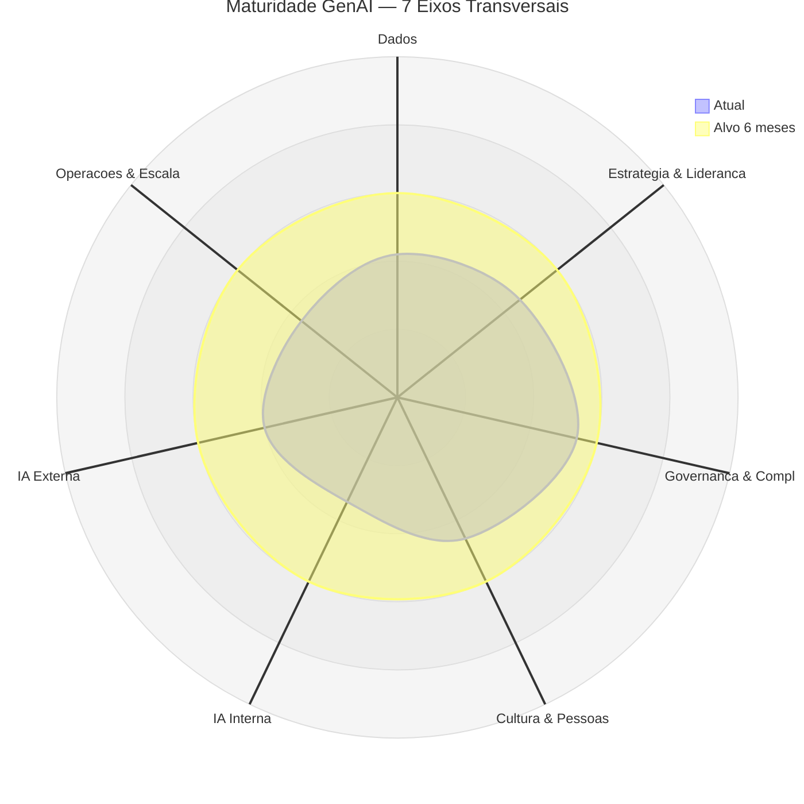
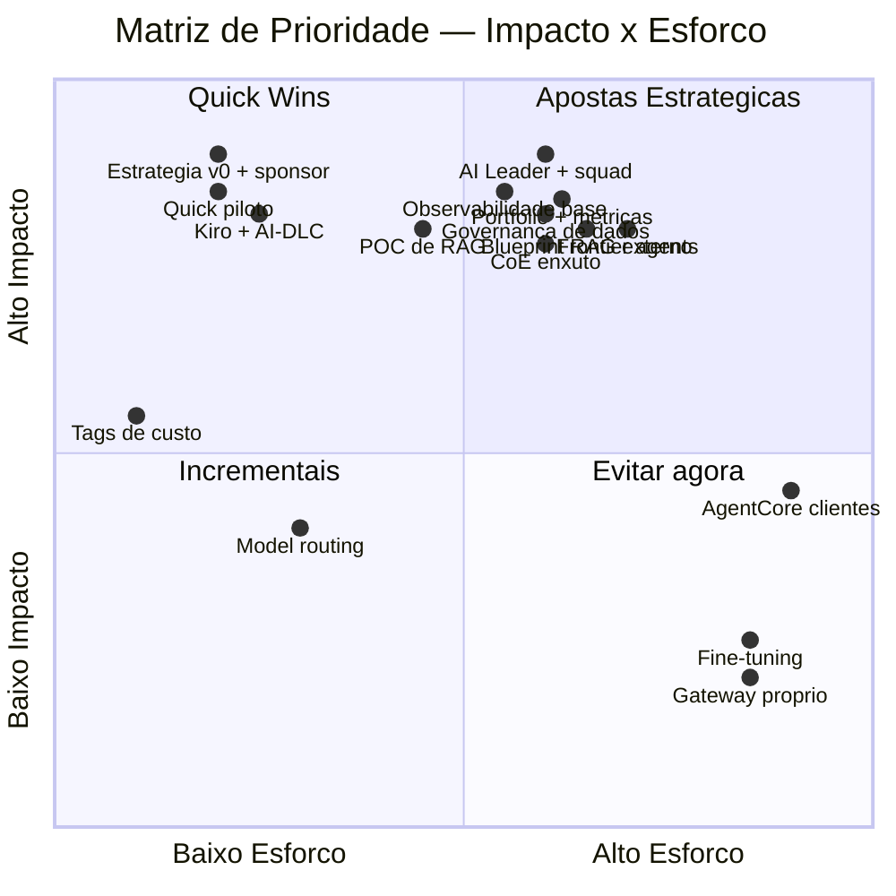
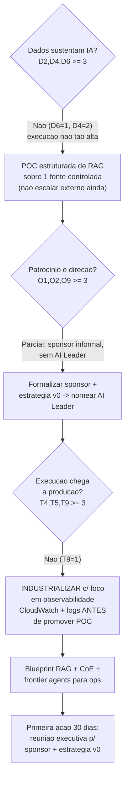
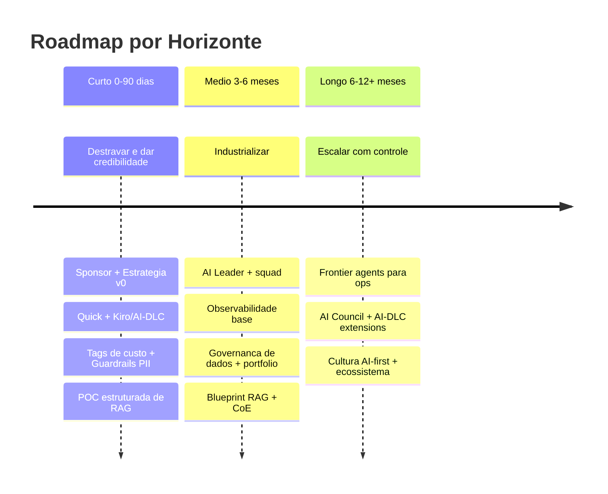

# Plano de Ação Cruzado — Maturidade em IA Generativa

## 📊 Painel Consolidado

| Survey | Score Bruto | Máximo | % | Nível |
|--------|:-----------:|:------:|:-:|-------|
| 1 — Dados | 17 | 40 | 42,5% | 🟡 Média-Baixa |
| 2 — Organizacional | 29 | 60 | 48,3% | 🟡 Média-Baixa |
| 3 — Técnica | 22 | 60* | 36,67% | 🟡 Média-Baixa (fronteira) |
| **Consolidado** | **68** | **160** | **42,5%** | 🟡 **Média-Baixa** |

*T6 (MLOps/FMOps) marcada N/A e excluída do denominador.

**Radar dos 7 eixos transversais:**

| Eixo | Score | Observação de cruzamento |
|------|:-----:|--------------------------|
| Dados | 2,1 | D6=1 (RAG) puxa o teto — lacuna crítica |
| Estratégia & Liderança | 2,3 | Sponsor informal, sem AI Leader |
| Governança & Compliance | 2,7 | O5/O11=3 mascaram D4=2 (elo fraco) |
| Cultura & Pessoas | 2,3 | Change mgmt=3 é o ativo; literacy=2 |
| IA Interna | 1,7 | Shadow AI; ops de TI (T3)=1 |
| IA Externa | 2,0 | POCs sem chegar à produção |
| Operações & Escala | 1,8 | Observabilidade (T9)=1 bloqueia tudo |

## 🧭 Padrão Identificado

**Arquétipo: Equilibrado Médio com Execução em trailing.** As três surveys estão na mesma faixa (Média-Baixa), com a Técnica meio passo atrás. A maior distância entre eixos (Governança 2,7 vs. IA Interna 1,7) é de ~1 nível, confirmando o perfil equilibrado.

A história aqui é a do **potencial disperso**: capacidade pontual real (pipelines de dados D5=3, versionamento D7=3, change management O10=3, parceria de cloud O12=3) coexistindo com lacunas estruturais que impedem essas forças de render valor — sem estratégia de RAG (D6=1), sem observabilidade (T9=1), sem operações assistidas (T3=1), sem AI Leader (O9=2). A organização opera no mundo dos "projetos de IA", não no de "portfólio com ROI gerenciado".

O risco central não é a inação — é o **cemitério de POCs**: experimentos que consomem energia, não chegam à produção e viram dívida técnica, corroendo a confiança executiva antes que o valor apareça.

## 🔍 Gaps Críticos Cross-Cutting

1. **Estratégia de RAG ausente (D6=1) sobre pipelines que existem (D5=3).** A organização tem o encanamento mas não a estratégia de canalizar conhecimento proprietário. Maior alavanca isolada de dados.
2. **Observabilidade zero (T9=1) com POCs caminhando para produção (T4=2).** Promover qualquer caso a clientes hoje é risco não gerenciado — bloqueia o próximo passo e qualquer frontier agent.
3. **Governança aparente vs. real (O5/O11=3, mas D4=2).** O elo mais fraco define o teto. Há política de IA responsável, mas a governança de dados para IA não a sustenta.
4. **Liderança difusa (O9=2) como multiplicador negativo.** Sem AI Leader, estratégia (O1=2), portfólio (O4=2) e métricas (O6=2) não avançam.
5. **Shadow AI interno (T1=2, T3=1).** Ganhos internos fáceis (baixo risco, ROI rápido) não capturados antes de mirar o externo.

## 🎯 Matriz de Prioridade (Impacto × Esforço)

| Ação | Impacto | Esforço | Quadrante | Pré-requisitos | Dimensões | Horizonte |
|------|:-------:|:-------:|-----------|----------------|-----------|:---------:|
| Cost allocation tags obrigatórias | Médio | Muito baixo | Quick Win | — | T13, O3 | 0–90d |
| Amazon Quick Free/Plus piloto | Alto | Baixo | Quick Win | — | T1 | 0–90d |
| Kiro + AI-DLC no piloto | Alto | Baixo | Quick Win | Kiro em uso | T2 | 0–90d |
| Estratégia v0 + sponsor formal | Alto | Baixo | Quick Win | — | O1, O2 | 0–90d |
| POC estruturada de RAG (Bedrock KB) | Alto | Médio | Quick Win | Guardrails PII | D6, D3 | 0–90d |
| Observabilidade base (CloudWatch + logs) | Alto | Médio | Aposta | — | T9 | 3–6m |
| Governança de dados p/ IA (Lake Formation) | Alto | Médio | Aposta | — | D4, O5 | 3–6m |
| AI Leader + squad multidisciplinar | Alto | Médio | Aposta | Estratégia v0 | O9 | 3–6m |
| Portfólio gerenciado + métricas duais | Alto | Médio | Aposta | AI Leader | O4, O6 | 3–6m |
| Blueprint único de RAG p/ externo | Alto | Médio | Aposta | D4≥3, T7≥3 | T4, T5, T7 | 3–6m |
| CoE enxuto (4-6 pessoas) | Alto | Médio | Aposta | — | T10, T11 | 3–6m |
| Frontier agents (DevOps → Security) | Alto | Médio | Aposta | T9≥3, T7≥3 | T3 | 6–12m |
| Model routing simples | Médio | Baixo | Incremental | Observabilidade | T12, T13 | 6–12m |
| Fine-tuning | Baixo (agora) | Alto | Evitar | D6≥3, T8≥3 | — | — |
| AgentCore p/ clientes | Médio (agora) | Alto | Evitar | T5≥4, T9≥3 | — | — |
| Plataforma própria de gateway | Baixo | Alto | Evitar | — | — | — |

## 🌳 Árvore de Decisão

## 🛣️ Plano de Ação por Horizonte

**⚡ Curto (0–90 dias) — destravar e dar credibilidade**
- **Formalizar sponsor + Estratégia v0 (1 página).** Sem norte comum, cada iniciativa reinventa as mesmas questões. Alvo: O1 2→3, O2 informal→formal.
- **Amazon Quick + Kiro/AI-DLC no piloto.** Tira do shadow AI (T1=2, T3=1), captura ROI interno rápido. Alvo: T1, T2 →3.
- **Cost allocation tags + Guardrails PII.** Pré-requisito de FinOps (T13) e governança (D4).
- **POC estruturada de RAG (Bedrock KB).** Ataca D6=1 com gate (1→2 via POC). Aproveita pipelines existentes (D5=3).

**📈 Médio (3–6 meses) — industrializar**
- **AI Leader dedicado + squad.** Maior alavanca isolada. Alvo: O9 2→3.
- **Observabilidade base.** T9=1 bloqueia frontier agents e deploy externo. Alvo: T9 1→3 (com gate).
- **Governança de dados + portfólio com métricas duais.** Fecha o elo fraco D4=2; substitui medição anedótica (O6=2). Alvo: D4→3, O4/O6→3.
- **Blueprint único de RAG + CoE enxuto.** Converte POCs em produto. Pré-requisito: D4≥3 e T7≥3.

**🚀 Longo (6–12+ meses) — escalar com controle**
- **Frontier agents para ops (DevOps → Security).** Com T9≥3 e T7≥3, entrada segura para "agents que agem". Ataca T3=1.
- **AI Council formal + AI-DLC com extensions próprias.** Governança como policy-as-code.
- **Cultura AI-first + ecossistema orquestrado.** Alavanca O12=3, hoje subutilizado.

## 📋 Guidelines de Execução

1. **Interno antes de externo.** Capture ROI com Quick/Kiro antes de escalar para clientes.
2. **Um incremento por dimensão por trimestre.** D6 1→2 via POC; T9 1→3 com gate intermediário.
3. **Nenhum POC vira produção sem dono de negócio + hipótese de ROI + dataset de referência.**
4. **Observabilidade e governança de dados são pré-requisito.** Não promova nada ao cliente sem T9≥3 e D4≥3.
5. **O AI Leader aprova extensions e padrões, não cada PR.**

## 🚫 O Que Evitar Agora

- **Fine-tuning** — sem D6≥3 e avaliação estruturada (T8=2), piora antes de melhorar.
- **Agents autônomos para clientes / AgentCore** — T9=1 e T7=2 tornam ingerenciável.
- **Frontier agents antes da fundação** — pressupõem observabilidade e segurança ausentes.
- **Plataforma própria de gateway** — Bedrock resolve.
- **Escalar Quick sem IAM Identity Center** — criaria shadow AI pior.

## 🏁 Conclusão

A maior alavanca não é tecnológica: é **nomear um AI Leader e formalizar a estratégia**. Com 42,5% de maturidade e as três dimensões na mesma faixa, a organização tem fundações reais (D5=3, D7=3, O10=3, O12=3). Falta estrutura, disciplina e direção. O próximo milestone que muda o nível é atingível em 90–120 dias: tirar a Técnica da fronteira (T9 1→3, D6 1→2), formalizar patrocínio e montar portfólio gerenciado. Não é transformação — é execução disciplinada.
