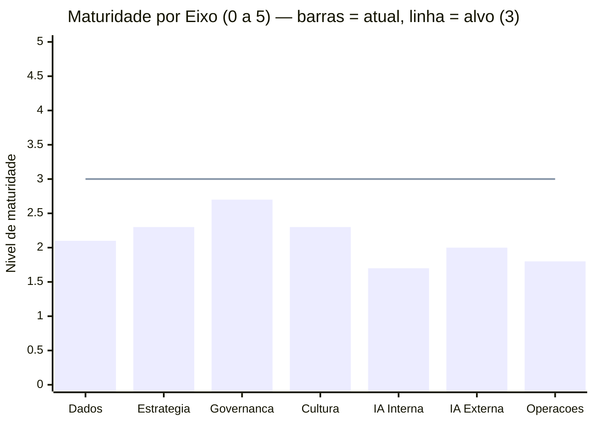
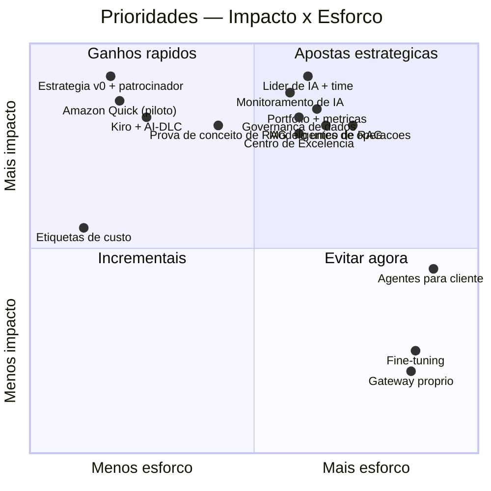
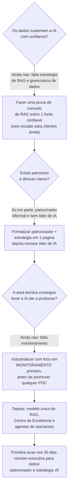
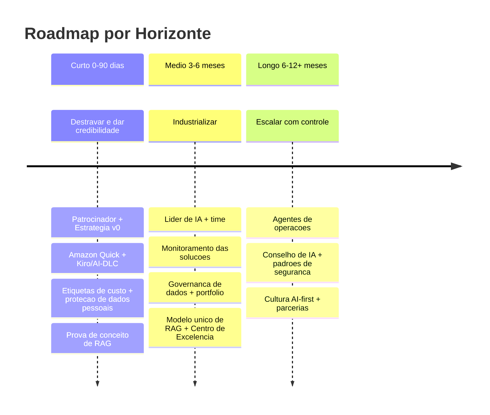

# Plano de Ação Cruzado — Maturidade em IA Generativa

> Como ler este documento: cada área é avaliada de **1 a 5** (1 = inexistente, 3 = definido/em experimentação, 5 = otimizado em escala). Os códigos entre parênteses (ex: D6, O9) servem só para rastrear de volta às perguntas das surveys — o que importa é o nome e o nível.

## 📊 Painel Consolidado

| Avaliação | Pontuação | Máximo | % | Nível |
|-----------|:---------:|:------:|:-:|-------|
| Dados | 17 | 40 | 42,5% | 🟡 Média-Baixa |
| Organização e Estratégia | 29 | 60 | 48,3% | 🟡 Média-Baixa |
| Capacidade Técnica | 22 | 60* | 36,67% | 🟡 Média-Baixa (na fronteira) |
| **Consolidado** | **68** | **160** | **42,5%** | 🟡 **Média-Baixa** |

*A área de MLOps/FMOps (ciclo de vida de modelos) foi marcada como "não se aplica" e excluída da conta — coerente, pois a organização ainda não opera modelos próprios em produção.

**Maturidade por eixo (média de 1 a 5):**

| Eixo | Nível | O que está por trás |
|------|:-----:|---------------------|
| Dados | 2,1 | Puxado para baixo pela ausência de estratégia de RAG (nível 1) |
| Estratégia & Liderança | 2,3 | Patrocínio executivo informal e sem liderança dedicada de IA |
| Governança & Compliance | 2,7 | Política de IA responsável existe, mas a governança dos dados não a sustenta |
| Cultura & Pessoas | 2,3 | Gestão de mudança é o ponto forte; letramento e confiança ainda baixos |
| IA Interna (produtividade) | 1,7 | Uso informal de IA ("shadow AI"); operações de TI sem nenhuma automação |
| IA Externa (produtos) | 2,0 | Provas de conceito que não chegam à produção |
| Operações & Escala | 1,8 | Sem nenhum monitoramento de IA — isso bloqueia quase tudo |

*Leitura do gráfico: as barras mostram o nível atual de cada eixo; a linha em 3 é a meta para os próximos 6 meses. Nenhum eixo chegou ainda ao nível "definido" (3).*

Posição geral: **42,5%** — equivalente ao estágio "Experimentação" (AWS) / "Em Desenvolvimento" (Gartner).

## 🧭 O Padrão Identificado

**Perfil: equilíbrio em nível médio, com a parte técnica meio passo atrás.** As três avaliações caíram na mesma faixa (Média-Baixa), e a maior diferença entre eixos é de cerca de um nível (Governança 2,7 contra IA Interna 1,7). Ou seja: não há um único vilão isolado — há um **conjunto de fundações inacabadas**.

A situação que a organização vive hoje é a do **potencial disperso**: existem capacidades reais e valiosas — os pipelines de dados funcionam (nível 3), há versionamento de dados (nível 3), a empresa já sabe conduzir gestão de mudança (nível 3) e tem relacionamento com provedor de nuvem (nível 3). Mas essas forças não se convertem em valor porque faltam as peças que as conectam: não há estratégia para usar os dados próprios em IA, não há monitoramento das soluções, não há ninguém formalmente dedicado a liderar o tema.

O risco central não é ficar parado — é o **"cemitério de provas de conceito"**: experimentos que consomem energia, nunca chegam à produção e viram dívida técnica, corroendo a confiança da liderança antes que qualquer valor apareça.

## 🔍 Os Cinco Gaps Mais Importantes (que só aparecem ao cruzar as avaliações)

1. **Os dados estão prontos para fluir, mas não há para onde levá-los.** Os pipelines de dados funcionam bem (nível 3), porém não existe estratégia de RAG — a técnica de usar os documentos e o conhecimento próprio da empresa para alimentar a IA (nível 1). É o encanamento instalado sem a torneira. *Maior oportunidade isolada na área de dados.*

2. **A empresa está prestes a colocar IA na frente do cliente, sem nenhum painel de controle.** Há provas de conceito caminhando para produção (nível 2), mas o monitoramento das soluções de IA é inexistente (nível 1). Subir algo para o cliente assim é dirigir sem painel — e ainda trava a adoção de qualquer agente de operações.

3. **A governança parece melhor do que é.** A política de IA responsável e o acompanhamento regulatório estão em nível 3, mas a governança dos *dados* usados pela IA está em nível 2. O elo mais fraco é que define o risco real: dados sensíveis podem entrar nas soluções sem o controle adequado.

4. **Ninguém está no volante — e isso trava todo o resto.** Não há liderança dedicada de IA (nível 2). Sem um dono, a estratégia não avança (nível 2), o portfólio de casos de uso não é gerenciado (nível 2) e os resultados não são medidos (nível 2). É o gargalo que impede transformar as capacidades existentes em resultado.

5. **As pessoas já usam IA por conta própria, sem caminho oficial.** A produtividade com IA é informal (nível 2) e as operações de TI não usam IA alguma (nível 1). Os ganhos internos mais fáceis e de menor risco ainda não foram capturados — e eles seriam o melhor combustível para conquistar patrocínio.

## 🎯 Matriz de Prioridade (Impacto × Esforço)

| Ação | Impacto | Esforço | Quadrante | O que destrava |
|------|:-------:|:-------:|-----------|----------------|
| Padronizar etiquetas de custo (cost tags) | Médio | Muito baixo | Ganho rápido | Visão de custos + base de FinOps |
| Distribuir IA de produtividade (Amazon Quick) no piloto | Alto | Baixo | Ganho rápido | Tira a IA do uso informal |
| Padronizar Kiro + AI-DLC na engenharia | Alto | Baixo | Ganho rápido | Engenharia com IA consistente |
| Estratégia de IA v0 (1 página) + patrocinador formal | Alto | Baixo | Ganho rápido | Dá direção comum a tudo |
| Prova de conceito estruturada de RAG | Alto | Médio | Ganho rápido | Conhecimento próprio na IA |
| Monitoramento básico das soluções de IA | Alto | Médio | Aposta estratégica | Pré-requisito para produção |
| Governança dos dados usados em IA | Alto | Médio | Aposta estratégica | Fecha o elo fraco de risco |
| Nomear líder dedicado de IA + time | Alto | Médio | Aposta estratégica | Destrava estratégia, portfólio e métricas |
| Portfólio gerenciado + métricas de valor | Alto | Médio | Aposta estratégica | Sai de "projeto" para "portfólio" |
| Modelo único de RAG para clientes | Alto | Médio | Aposta estratégica | Converte POC em produto |
| Centro de Excelência enxuto (4-6 pessoas) | Alto | Médio | Aposta estratégica | Padrões e reuso |
| Agentes de operações (DevOps, depois Segurança) | Alto | Médio | Aposta estratégica | Automatiza operações de TI |
| Fine-tuning de modelos | Baixo agora | Alto | Evitar agora | Sem base, piora antes de melhorar |
| Plataforma de agentes para clientes | Médio agora | Alto | Evitar agora | Sem monitoramento, é ingerenciável |
| Plataforma própria de gateway | Baixo | Alto | Evitar agora | A nuvem já resolve |

*Comece pelos "ganhos rápidos" (canto superior esquerdo: estratégia v0, Amazon Quick, Kiro/AI-DLC, prova de conceito de RAG). As "apostas estratégicas" (superior direito: líder de IA, monitoramento, governança de dados) têm impacto igualmente alto, mas exigem mais tempo. O que está embaixo à direita (fine-tuning, agentes para clientes, gateway próprio) deve esperar.*

## 🌳 Árvore de Decisão — do hoje à primeira ação

## 🛣️ Plano de Ação por Horizonte

### ⚡ Curto prazo (0 a 90 dias) — destravar e ganhar credibilidade
- **Formalizar um patrocinador executivo e escrever a estratégia de IA em uma página.** *Por quê:* sem uma direção comum, cada iniciativa começa do zero e o conjunto fica invisível para a liderança. Esse documento simples é o que destrava todas as outras frentes.
- **Distribuir uma ferramenta oficial de produtividade com IA (Amazon Quick) e padronizar o Kiro com AI-DLC na engenharia.** *Por quê:* hoje as pessoas já usam IA por conta própria, sem controle. Um caminho oficial captura ganho rápido, de baixo risco — e esse resultado é o melhor argumento para conquistar orçamento.
- **Padronizar etiquetas de custo e ativar proteção de dados pessoais (PII).** *Por quê:* são passos triviais e pré-requisito de tudo: ninguém deveria subir um recurso de IA sem saber quanto custa e sem proteger dados sensíveis.
- **Fazer uma prova de conceito estruturada de RAG.** *Por quê:* ataca a maior lacuna de dados (estratégia de RAG, nível 1) aproveitando os pipelines que já funcionam (nível 3). Faça com metas de qualidade definidas antes de começar, para gerar evidência — não só uma demonstração.

### 📈 Médio prazo (3 a 6 meses) — industrializar
- **Nomear um líder dedicado de IA com um time multidisciplinar.** *Por quê:* é a maior alavanca isolada. Sem um dono, estratégia, portfólio e métricas não andam. Ignorar isso mantém a IA competindo em desvantagem com o dia a dia do negócio.
- **Implantar monitoramento básico das soluções de IA.** *Por quê:* hoje não há nenhum (nível 1), e isso é um risco não gerenciado que bloqueia tanto a ida para produção quanto o uso de agentes. É o pré-requisito mais urgente da área técnica.
- **Estruturar a governança dos dados usados em IA e montar um portfólio com métricas de valor.** *Por quê:* fecha o elo fraco que faz a governança parecer melhor do que é, e troca a medição "por impressão" por ROI de verdade.
- **Criar um modelo único de RAG para clientes e um Centro de Excelência enxuto.** *Por quê:* é o que converte provas de conceito em produto e práticas individuais em padrão da casa. Só avance para o cliente depois da governança de dados e da segurança em nível 3.

### 🚀 Longo prazo (6 a 12+ meses) — escalar com controle
- **Adotar agentes de operações (começando por DevOps, depois Segurança).** *Por quê:* com monitoramento e segurança já maduros, é a porta de entrada segura para "agentes que agem" — um ensaio controlado antes de construir agentes para o cliente final.
- **Formalizar um Conselho de IA e padrões de segurança automatizados.** *Por quê:* governança que funciona como regra automática, agora que há um portfólio real para governar.
- **Construir cultura "AI-first" e orquestrar o ecossistema de parceiros.** *Por quê:* institucionaliza os ganhos e aproveita o relacionamento de nuvem que hoje está subutilizado.

## 📋 Guidelines de Execução

1. **Use IA internamente antes de levá-la ao cliente.** Capture ganho de produtividade primeiro — é rápido e de baixo risco.
2. **Suba um nível de cada vez por trimestre.** Não pule etapas (a estratégia de RAG vai do nível 1 ao 2 via prova de conceito, depois ao 3 — nunca direto).
3. **Nenhuma prova de conceito vira produção sem dono de negócio, hipótese de retorno e um conjunto de testes de referência.** Essa é a regra que esvazia o "cemitério de POCs".
4. **Monitoramento e governança de dados são pré-requisito, não luxo.** Não coloque nada na frente do cliente sem os dois em nível 3.
5. **O líder de IA aprova padrões, não cada entrega.** Governança que acelera, não que trava.

## 🚫 O Que Evitar Agora

- **Fine-tuning de modelos** — sem estratégia de RAG e sem avaliação estruturada, customizar modelo piora o resultado antes de melhorar.
- **Agentes autônomos para clientes** — sem monitoramento e com segurança ainda básica, fica impossível de gerenciar.
- **Agentes de operações antes da fundação** — eles pressupõem monitoramento e segurança que ainda não existem.
- **Plataforma própria de gateway de modelos** — a nuvem já resolve; só adiciona complexidade.
- **Escalar a ferramenta de produtividade sem login corporativo unificado** — criaria um uso informal pior, agora com dados da empresa.

## 🏁 Conclusão

A maior alavanca não é tecnológica: é **nomear um líder de IA e formalizar a estratégia**. Com 42,5% de maturidade e as três frentes na mesma faixa, a organização tem fundações reais — pipelines de dados, versionamento, experiência em gestão de mudança e parceria de nuvem. O que falta é estrutura, disciplina e direção. O próximo salto de nível é concreto e alcançável em 90 a 120 dias: tirar a parte técnica da fronteira (implantar monitoramento e avançar a prova de conceito de RAG), formalizar o patrocínio e montar um portfólio gerenciado. Isso não é transformação — é execução disciplinada. A janela está aberta agora.

---

## 📖 Glossário das Siglas

As surveys avaliam cada área com um código. Use esta tabela para rastrear qualquer sigla citada no plano de volta à pergunta de origem. A escala é sempre de 1 (inexistente) a 5 (otimizado em escala).

**Dados (D)**

| Código | Significado |
|--------|-------------|
| D1 | Inventário e catalogação de dados |
| D2 | Qualidade e representatividade dos dados |
| D3 | Capacidade com dados não-estruturados (documentos, imagens, áudio) |
| D4 | Governança de dados para IA |
| D5 | Automação dos pipelines de dados |
| D6 | Estratégia de RAG e customização de modelos |
| D7 | Versionamento e rastreabilidade de dados |
| D8 | Compartilhamento e democratização de dados |

**Organização e Estratégia (O)**

| Código | Significado |
|--------|-------------|
| O1 | Estratégia de IA |
| O2 | Patrocínio executivo |
| O3 | Investimento e funding |
| O4 | Portfólio de casos de uso |
| O5 | Governança de IA e gestão de riscos |
| O6 | Métricas e medição de valor (ROI) |
| O7 | Letramento em IA e cultura |
| O8 | Confiança organizacional em IA |
| O9 | Liderança dedicada de IA |
| O10 | Gestão de mudança (change management) |
| O11 | Compliance e regulamentação |
| O12 | Ecossistema e parcerias |

**Capacidade Técnica (T)**

| Código | Significado |
|--------|-------------|
| T1 | Produtividade interna com IA |
| T2 | Engenharia de software com IA |
| T3 | Operações de TI com IA (segurança, infraestrutura, custos) |
| T4 | Aplicações de IA para clientes |
| T5 | Infraestrutura e plataforma de IA |
| T6 | MLOps / FMOps (ciclo de vida de modelos) |
| T7 | Segurança específica para IA |
| T8 | Avaliação e qualidade de modelos |
| T9 | Observabilidade e monitoramento |
| T10 | Modelo operacional (quem cuida de IA) |
| T11 | Velocidade e reuso de componentes |
| T12 | Escalabilidade e integração |
| T13 | Gestão de custos de IA (FinOps) |

**Escala de níveis**

| Nível | Significado |
|-------|-------------|
| 1 | Inexistente / ad hoc |
| 2 | Inicial / consciente |
| 3 | Definido / em experimentação |
| 4 | Gerenciado / em produção |
| 5 | Otimizado / em escala |

**Termos técnicos**

| Termo | O que é |
|-------|---------|
| RAG | Técnica que conecta a IA aos documentos e ao conhecimento próprio da empresa, para que as respostas usem o contexto interno |
| POC / Prova de conceito | Experimento pequeno para validar uma ideia antes de investir em produção |
| Fine-tuning | Customização do modelo treinando-o com dados próprios |
| FinOps | Gestão e otimização de custos na nuvem |
| AI-DLC | Metodologia de desenvolvimento de software com IA (fases com aprovação humana) |
