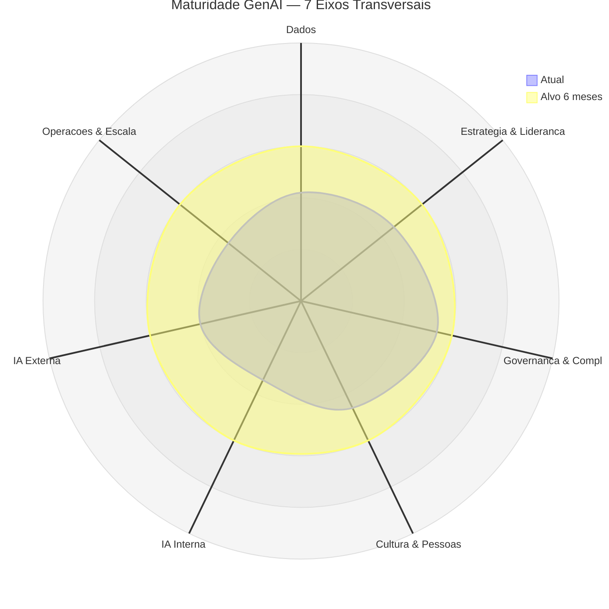
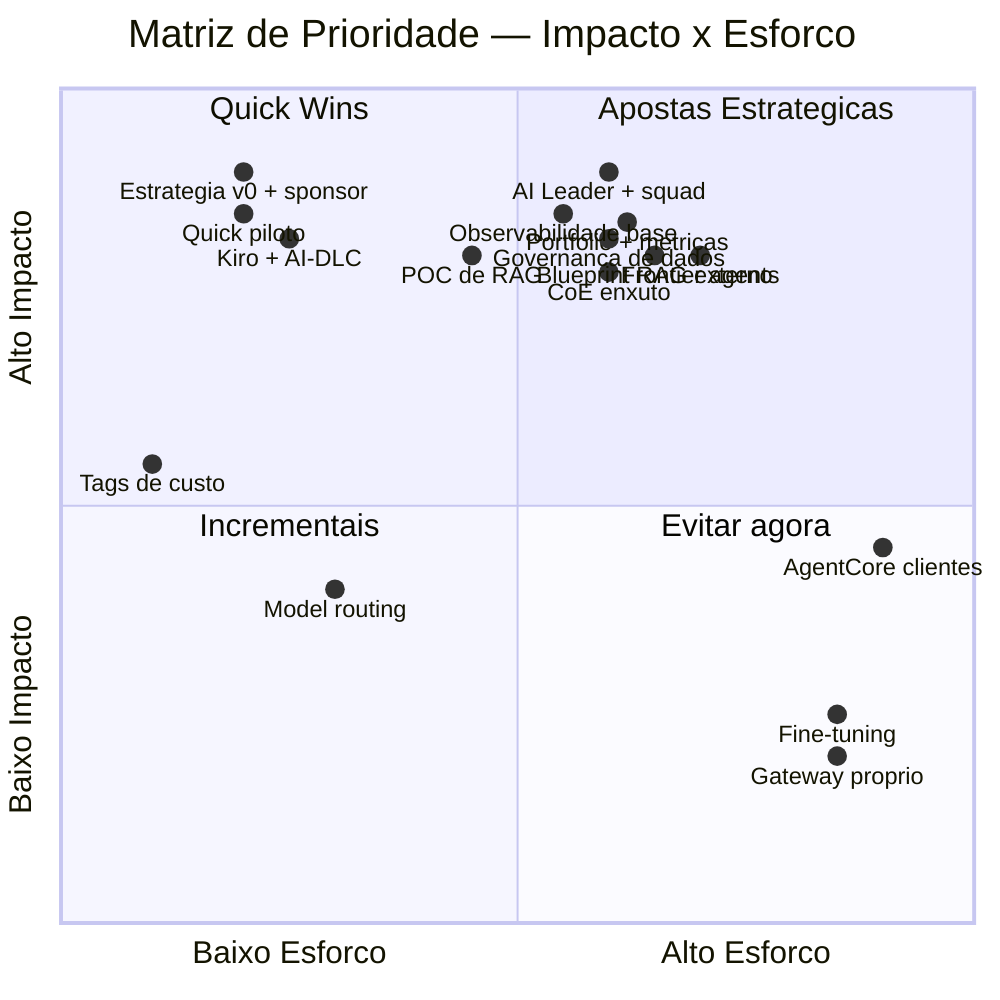
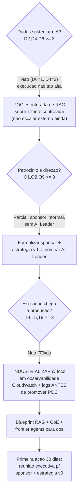
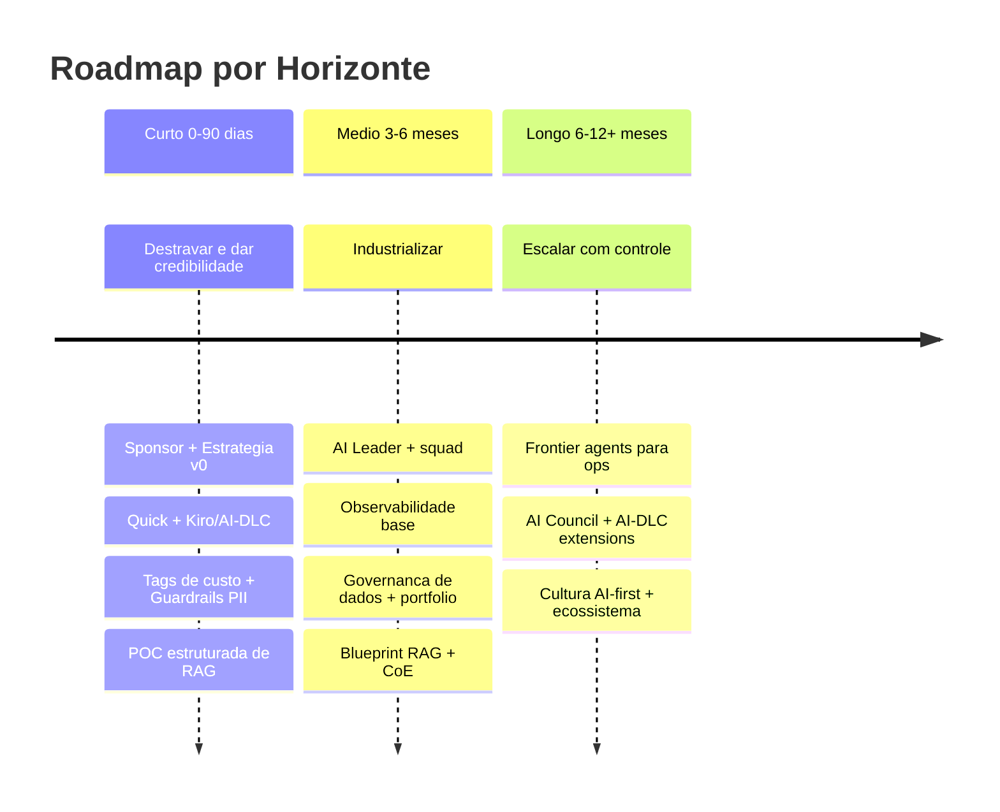

# Exemplo de Relatório Cruzado (calibração de tom e profundidade)

> Entrada usada: Dados 17/40 (42,5%), Organizacional 29/60 (48,3%), Técnica 22/60 (36,67% — T6 N/A excluída). Este é o output esperado da skill para um perfil **Equilibrado Médio com Execução trailing**.

---

# Plano de Ação Cruzado — Maturidade em IA Generativa

## 📊 Painel Consolidado

| Survey | Score Bruto | Máximo | % | Nível |
|--------|:-----------:|:------:|:-:|-------|
| 1 — Dados | 17 | 40 | 42,5% | 🟡 Média-Baixa |
| 2 — Organizacional | 29 | 60 | 48,3% | 🟡 Média-Baixa |
| 3 — Técnica | 22 | 60* | 36,67% | 🟡 Média-Baixa (fronteira) |
| **Consolidado** | **68** | **160** | **42,5%** | 🟡 **Média-Baixa** |

*Survey 3: máximo ajustado para 60 (T6 marcada N/A, excluída do denominador).

**Radar dos 7 eixos transversais:**

| Eixo | Score médio | Nível | Observação de cruzamento |
|------|:-----------:|-------|--------------------------|
| Dados | 2,1/5 | 🟡 | D6 (RAG)=1 puxa o teto — lacuna crítica |
| Estratégia & Liderança | 2,3/5 | 🟡 | Sponsor informal, sem AI Leader |
| Governança & Compliance | 2,7/5 | 🟡 | O5/O11=3 mascaram D4=2 (elo fraco) |
| Cultura & Pessoas | 2,3/5 | 🟡 | Change mgmt=3 é o ativo; literacy=2 |
| IA Interna | 1,7/5 | 🔴 | Shadow AI; T3 ops=1 |
| IA Externa | 2,0/5 | 🟡 | POCs sem chegar à produção |
| Operações & Escala | 1,8/5 | 🔴 | Observabilidade=1 bloqueia tudo |

Consolidado: `[████░░░░░░] 42,5%` — Média-Baixa, equivalente AWS **Experiment**, Gartner **Defined**.



## 🧭 Padrão Identificado

**Arquétipo: Equilibrado Médio com Execução em trailing.** As três dimensões estão na mesma faixa (Média-Baixa), com a Técnica um passo atrás — não o suficiente para ser "Execução-Gargalo" clássico, mas o bastante para definir o foco. A organização despertou para IA em todas as frentes: há interesse executivo, políticas iniciais de governança, dados com pipelines funcionais e times usando code assistants. Mas opera no mundo dos **"projetos de IA"**, não no de **"portfólio de IA com ROI gerenciado"**.

A história que esta organização vive hoje é a do **potencial disperso**: capacidade pontual real (pipelines de dados, versionamento, change management consciente) coexistindo com lacunas estruturais (sem estratégia formal de RAG, sem observabilidade, sem AI Leader, sem métricas). O risco central deste padrão não é a inação — é o **cemitério de POCs**: experimentos que consomem energia, não chegam à produção e viram dívida técnica, corroendo a confiança executiva antes que o valor apareça.

## 🔍 Gaps Críticos Cross-Cutting

1. **Estratégia de RAG ausente (D6=1) sobre pipelines que existem (D5=3)** — a organização tem o encanamento mas não a estratégia de canalizar o conhecimento proprietário. Cruzamento Dados×Técnica: o ativo de engenharia está subutilizado. **Maior alavanca de dados.**
2. **Observabilidade zero (T9=1) com POCs caminhando para produção (T4=2)** — promover qualquer caso a clientes hoje é risco não gerenciado. Cruzamento Operações×IA Externa: bloqueia o próximo passo natural.
3. **Governança aparente vs. real (O5/O11=3, mas D4=2)** — o elo mais fraco define o teto. Há política de IA responsável, mas a governança de *dados* para IA não a sustenta. PII entrará nos pipelines sem controle.
4. **Liderança difusa (O9=2) travando tudo** — sem AI Leader, estratégia não avança, portfólio não é gerenciado, métricas não são acompanhadas. É o multiplicador negativo do perfil.
5. **Shadow AI interno (T1=2, T3=1)** — produtividade sem canal oficial; ganhos fáceis não capturados antes de mirar o externo.

## 🎯 Matriz de Prioridade (Impacto × Esforço)

| Ação | Impacto | Esforço | Quadrante | Pré-requisitos | Dimensões | Horizonte |
|------|:-------:|:-------:|-----------|----------------|-----------|:---------:|
| Cost allocation tags obrigatórias | Médio | Muito baixo | Quick Win | — | T13, O3 | 0–90d |
| Amazon Quick Free/Plus piloto | Alto | Baixo | Quick Win | — | T1 | 0–90d |
| Kiro + AI-DLC no piloto | Alto | Baixo | Quick Win | Kiro em uso | T2 | 0–90d |
| Estratégia v0 + sponsor formal | Alto | Baixo | Quick Win | — | O1, O2 | 0–90d |
| POC estruturada de RAG (Bedrock KB) | Alto | Médio | Quick Win | Guardrails PII | D6, D3 | 0–90d |
| Observabilidade base (CloudWatch + logs) | Alto | Médio | Aposta | — | T9 | 3–6m |
| Governança de dados p/ IA (Lake Formation) | Alto | Médio | Aposta | — | D4, O5 | 3–6m |
| AI Leader + squad multidisciplinar | Alto | Médio | Aposta | Estratégia v0 | O9 | 3–6m |
| Portfólio gerenciado + métricas duais | Alto | Médio | Aposta | AI Leader | O4, O6 | 3–6m |
| Blueprint único de RAG p/ externo | Alto | Médio | Aposta | D4≥3, T7≥3 | T4, T5, T7 | 3–6m |
| CoE enxuto (4-6 pessoas) | Alto | Médio | Aposta | — | T10, T11 | 3–6m |
| Frontier agents (DevOps/Security) | Alto | Médio | Aposta | T9≥3, T7≥3 | T3 | 6–12m |
| Model routing simples | Médio | Baixo | Incremental | Observabilidade | T12, T13 | 6–12m |
| Fine-tuning | Baixo (agora) | Alto | Evitar | D6≥3, T8≥3 | — | — |
| AgentCore p/ clientes | Médio (agora) | Alto | Evitar | T5≥4, T9≥3 | — | — |
| Plataforma própria de gateway | Baixo | Alto | Evitar | — | — | — |



## 🌳 Árvore de Decisão



## 🛣️ Plano de Ação por Horizonte




### ⚡ Curto (0–90 dias) — destravar e dar credibilidade
- **Formalizar sponsor + Estratégia v0 (1 página).** *Por quê:* sem norte comum, cada iniciativa reinventa as mesmas questões e o portfólio fica invisível. É o desbloqueador de todas as outras dimensões. Alvo: O1 1→2, O2 informal→formal. Sinal: documento aprovado com 3 use cases priorizados.
- **Amazon Quick + Kiro/AI-DLC no piloto.** *Por quê:* tira do shadow AI, captura ROI interno rápido e baixo risco — combustível para conquistar patrocínio. Alvo: T1, T2 →3. Sinal: ≥50 usuários ativos; 1 use case rodando com AI-DLC.
- **Cost allocation tags + Guardrails PII.** *Por quê:* triviais e pré-requisito de FinOps e governança; nenhum recurso novo deve subir sem eles. Alvo: T13, D4. Sinal: 100% dos recursos de IA tagueados.
- **POC estruturada de RAG (Bedrock KB).** *Por quê:* ataca o gap crítico D6=1 com gate (POC→nível 2 antes de produção→nível 3, nunca 1→3). Aproveita os pipelines existentes (D5=3). Sinal: métricas de precisão/relevância definidas antes do início.

### 📈 Médio (3–6 meses) — industrializar
- **AI Leader dedicado + squad.** *Por quê:* é a maior alavanca isolada; sem dono, estratégia, portfólio e métricas não avançam. Alvo: O9 2→3+. *Custo de ignorar:* a agenda de IA continua competindo desigualmente com o core business.
- **Observabilidade base.** *Por quê:* T9=1 é risco não gerenciado e bloqueia frontier agents e deploy externo. Alvo: T9 1→3. Sinal: dashboards por use case + alertas de custo.
- **Governança de dados para IA + portfólio com métricas duais.** *Por quê:* fecha o elo fraco (D4) que mascara a governança aparente, e substitui medição anedótica por ROI gerenciado. Alvo: D4→3, O4/O6→3.
- **Blueprint único de RAG + CoE enxuto.** *Por quê:* converte POCs em produto e práticas individuais em padrão organizacional. *Pré-requisito:* D4≥3 e T7≥3 antes de externo.

### 🚀 Longo (6–12+ meses) — escalar com controle
- **Frontier agents para ops (DevOps → Security).** *Por quê:* com T9≥3 e T7≥3, são o ponto de entrada seguro para "agents que agem" — risk-controlled learning antes de agents para clientes.
- **AI Council formal + AI-DLC com extensions próprias.** *Por quê:* governança operacionalizada como policy-as-code, agora que há portfólio real para governar.
- **Cultura AI-first + ecossistema orquestrado.** *Por quê:* institucionaliza os ganhos e alavanca as parcerias de cloud (ativo O12=3 subutilizado).

## 📋 Guidelines de Execução

1. **Interno antes de externo.** Capture ROI com Quick/Kiro antes de escalar IA para clientes — gera confiança e patrocínio.
2. **Um incremento por dimensão por trimestre.** D6=1 vai para 2 via POC, depois 3 — nunca pule para produção direto.
3. **Nenhum POC vira produção sem dono de negócio + hipótese de ROI + dataset de referência.** Esse é o gate que esvazia o cemitério de POCs.
4. **Observabilidade e governança de dados são pré-requisito, não bônus.** Não promova nada ao cliente sem T9≥3 e D4≥3.
5. **O AI Leader aprova extensions e padrões, não cada PR.** Governança que acelera, não que trava.

## 🚫 O Que Evitar Agora
- **Fine-tuning** — sem D6≥3 e avaliação estruturada, piora antes de melhorar.
- **Agents autônomos para clientes / AgentCore** — T9=1 e T7=2 tornam ingerenciável.
- **Frontier agents antes da fundação** — pressupõem observabilidade e segurança que ainda não existem.
- **Plataforma própria de gateway** — Bedrock resolve; adiciona complexidade sem valor.
- **Escalar Quick sem IAM Identity Center** — criaria um shadow AI pior, agora com dados corporativos.

## 🏁 Conclusão

A maior alavanca disponível não é tecnológica: é **nomear um AI Leader e formalizar a estratégia**. Com 42,5% de maturidade consolidada e as três dimensões na mesma faixa, esta organização tem fundações reais — pipelines de dados, versionamento, consciência de governança e change management. O que falta é **estrutura, disciplina e direção**. O próximo milestone que muda o nível é concreto e atingível em 90–120 dias: tirar a Técnica da fronteira (observabilidade T9 de 1→3 e a POC de RAG de 1→2), formalizar o patrocínio e montar o portfólio gerenciado. Isso não é transformação — é execução disciplinada. O caminho está traçado; a janela está aberta agora.

## 🖼️ Exportar Diagramas (opcional)

Os diagramas acima estão em Mermaid. Para exportá-los em PNG (ex: para um deck executivo):

```bash
.kiro/skills/genai-maturity-crossanalysis/scripts/mermaid-to-png.sh este-relatorio.md ./out
```

Gera um PNG por diagrama em `./out/`. Requer Node.js. Rode apenas se desejar os arquivos de imagem.

---

## 📖 Glossário das Siglas

Incluir sempre. Tabela compacta com os códigos (D1–D8, O1–O12, T1–T13) e nomes por extenso — copiar de `references/dimension-names.md` — mais a escala de níveis (1 a 5) e termos técnicos citados (RAG, POC, fine-tuning, FinOps, AI-DLC). Torna o relatório autoexplicativo para quem não aplicou a survey.
