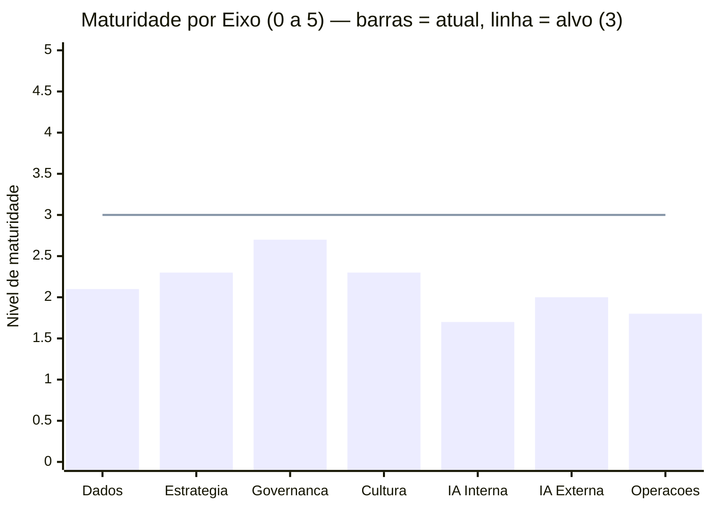
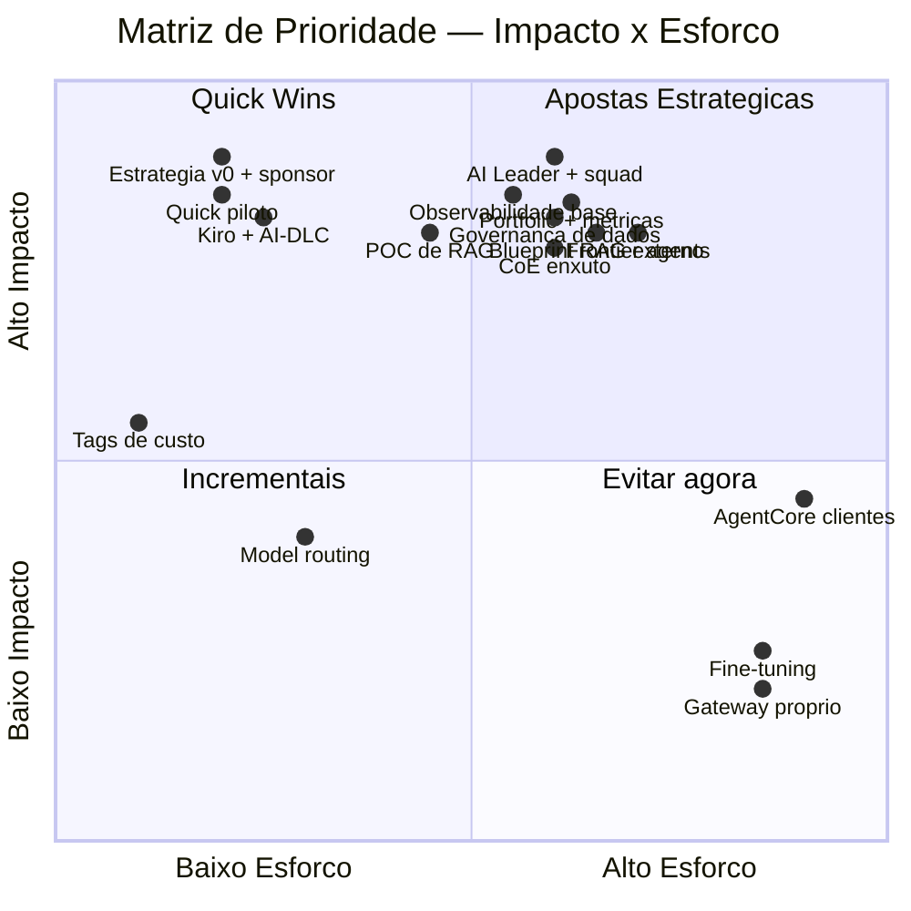
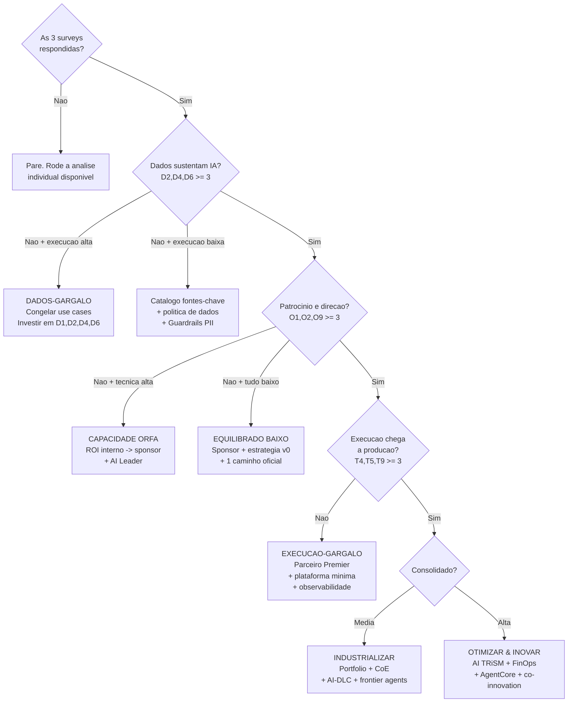
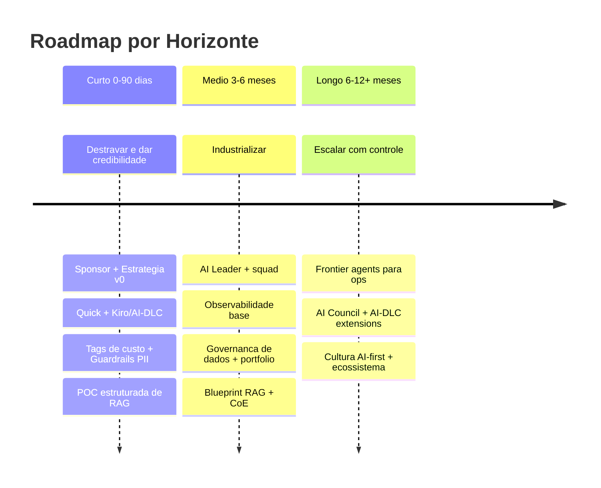
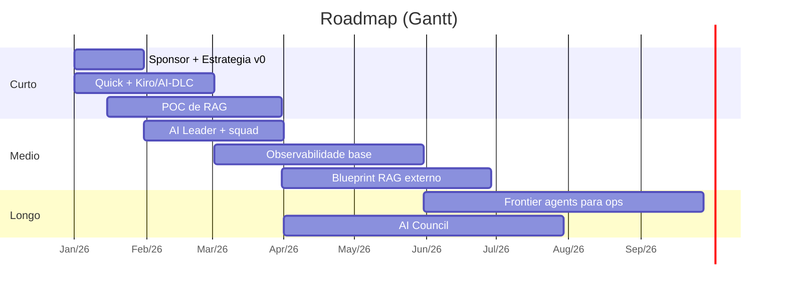

# Templates Mermaid dos Artefatos Visuais (Passo 8)

Mermaid é o **formato padrão** de todo diagrama do relatório. Gere os blocos inline (```` ```mermaid ````) preenchidos com os dados reais. Os exemplos abaixo usam o perfil do `example-report.md` (Dados 42,5% / Org 48,3% / Técnica 36,67%) — substitua pelos valores do diagnóstico em questão.

> Compatibilidade: `radar-beta`, `quadrantChart`, `flowchart`, `timeline` e `gantt` exigem Mermaid ≥ 11.6. Se o ambiente de renderização for mais antigo, há fallbacks indicados em cada seção.

---

## 1. Maturidade por eixo — gráfico de barras (PADRÃO)

Use **gráfico de barras**, não radar. É muito mais legível: cada eixo vira uma barra de 0 a 5, com uma linha de referência no nível-alvo. Radar com 2 curvas sobrepostas e 7 eixos abreviados fica ilegível — evite.



- As barras mostram o nível atual de cada eixo; a linha horizontal é o alvo do horizonte médio (nível 3).
- Sempre acompanhe o gráfico de uma legenda em texto explicando "barras = situação atual, linha = meta de 6 meses".
- Os rótulos do eixo X usam os nomes curtos do glossário (`dimension-names.md`).
- **Fallback (Mermaid < 11):** tabela de eixos com barras textuais `█/░`.

> Se o usuário pedir explicitamente um radar, use o template abaixo — mas com **uma única curva** (atual), nunca duas sobrepostas, e com legenda clara.
>
> ```mermaid
> radar-beta
>   title Maturidade por Eixo (0 a 5)
>   axis a["Dados"], b["Estrategia"], c["Governanca"], d["Cultura"], e["IA Interna"], f["IA Externa"], g["Operacoes"]
>   curve atual["Nivel atual"]{2.1, 2.3, 2.7, 2.3, 1.7, 2.0, 1.8}
>   max 5
>   min 0
> ```

---

## 2. Matriz de Prioridade (Impacto × Esforço)



- Eixo X = esforço (0 = baixo, 1 = alto). Eixo Y = impacto (0 = baixo, 1 = alto).
- Atenção: no `quadrantChart`, quadrant-1 = canto superior direito, quadrant-2 = superior esquerdo, quadrant-3 = inferior esquerdo, quadrant-4 = inferior direito. Ajuste os rótulos como acima.
- **Fallback:** a tabela da matriz em `priority-matrix.md`.

---

## 3. Árvore de Decisão



- Pode os ramos que não se aplicam ao perfil — destaque o caminho percorrido (ex: classe CSS `classDef destaque`).
- **Fallback:** o bloco ASCII de `decision-tree.md`.

---

## 4. Plano de Ação por Horizonte



- Alternativa com datas/dependências: usar `gantt` (útil quando o cliente quer cronograma).



- **Fallback:** lista por horizonte em texto.

---

## Exportar para PNG

Os diagramas vivem em Mermaid. Para entregar PNGs (ex: para colar em deck), use o script da skill — **somente quando o usuário pedir**.

```bash
# converte todos os blocos ```mermaid de um .md em PNGs:
.kiro/skills/genai-maturity-crossanalysis/scripts/mermaid-to-png.sh relatorio.md ./out

# converte um arquivo .mmd único:
.kiro/skills/genai-maturity-crossanalysis/scripts/mermaid-to-png.sh radar.mmd ./out
```

- O script usa `@mermaid-js/mermaid-cli` via `npx` (não precisa instalar global). Requer Node.js.
- Saída: um PNG por diagrama em `./out` (ex: `relatorio-1.png`, `relatorio-2.png`...).
- Se o usuário quiser fundo transparente ou escala maior, o script aceita flags (ver `--help`).
